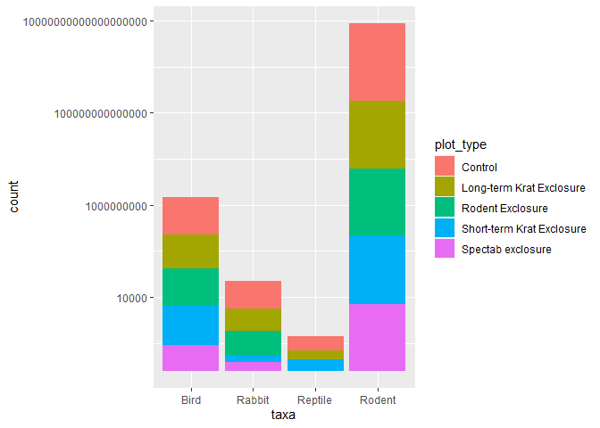
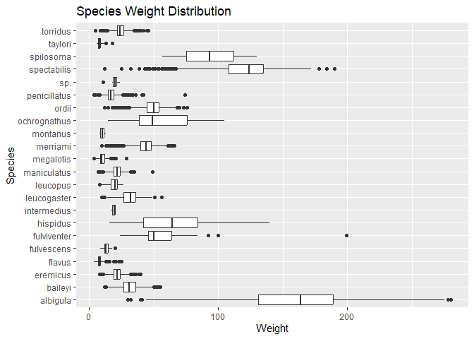
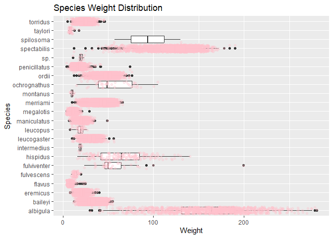
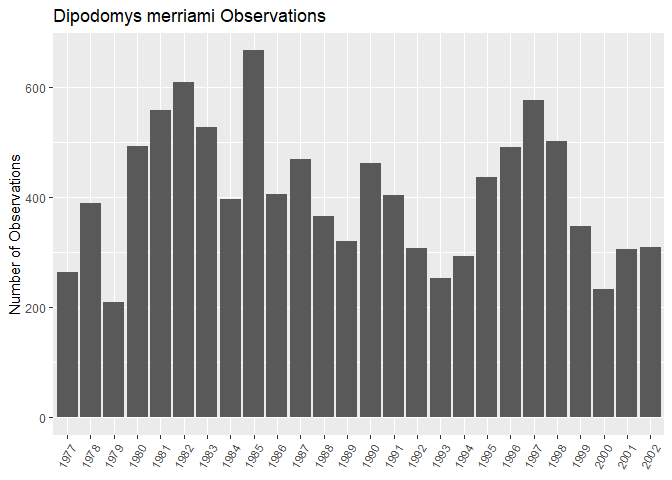
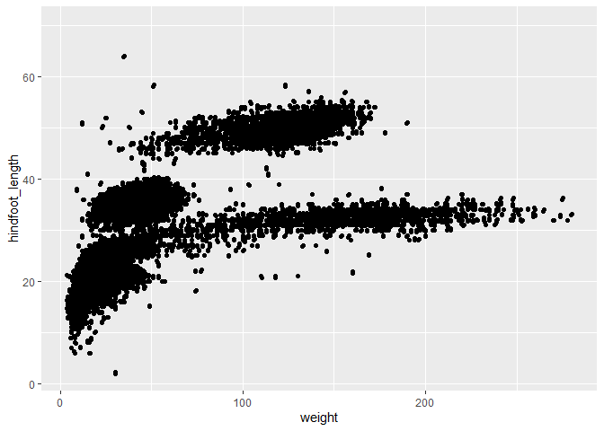
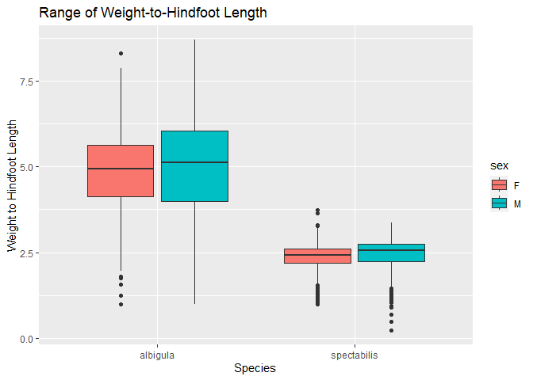

## Instructions
Answer the following questions and complete the exercises in RMarkdown. Please embed all of your code and push your final work to your repository. Your final lab report should be organized, clean, and run free from errors. Remember, you must remove the `#` for the included code chunks to run. Be sure to add your name to the author header above. For any included plots, make sure they are clearly labeled. You are free to use any plot type that you feel best communicates the results of your analysis.  

Make sure to use the formatting conventions of RMarkdown to make your report neat and clean!  

## Load the libraries

```r
library(tidyverse)
library(janitor)
library(here)
library(naniar)
```

```r
options(scipen=999)
```

## Desert Ecology
For this assignment, we are going to use a modified data set on [desert ecology](http://esapubs.org/archive/ecol/E090/118/). The data are from: S. K. Morgan Ernest, Thomas J. Valone, and James H. Brown. 2009. Long-term monitoring and experimental manipulation of a Chihuahuan Desert ecosystem near Portal, Arizona, USA. Ecology 90:1708.

```r
deserts <- read_csv(here("lab10", "data", "surveys_complete.csv"))
```

```
## Rows: 34786 Columns: 13
## ── Column specification ────────────────────────────────────────────────────────
## Delimiter: ","
## chr (6): species_id, sex, genus, species, taxa, plot_type
## dbl (7): record_id, month, day, year, plot_id, hindfoot_length, weight
## 
## ℹ Use `spec()` to retrieve the full column specification for this data.
## ℹ Specify the column types or set `show_col_types = FALSE` to quiet this message.
```

```r
deserts
```

```
## # A tibble: 34,786 × 13
##    record…¹ month   day  year plot_id speci…² sex   hindf…³ weight genus species
##       <dbl> <dbl> <dbl> <dbl>   <dbl> <chr>   <chr>   <dbl>  <dbl> <chr> <chr>  
##  1        1     7    16  1977       2 NL      M          32     NA Neot… albigu…
##  2        2     7    16  1977       3 NL      M          33     NA Neot… albigu…
##  3        3     7    16  1977       2 DM      F          37     NA Dipo… merria…
##  4        4     7    16  1977       7 DM      M          36     NA Dipo… merria…
##  5        5     7    16  1977       3 DM      M          35     NA Dipo… merria…
##  6        6     7    16  1977       1 PF      M          14     NA Pero… flavus 
##  7        7     7    16  1977       2 PE      F          NA     NA Pero… eremic…
##  8        8     7    16  1977       1 DM      M          37     NA Dipo… merria…
##  9        9     7    16  1977       1 DM      F          34     NA Dipo… merria…
## 10       10     7    16  1977       6 PF      F          20     NA Pero… flavus 
## # … with 34,776 more rows, 2 more variables: taxa <chr>, plot_type <chr>, and
## #   abbreviated variable names ¹​record_id, ²​species_id, ³​hindfoot_length
```

1. Use the function(s) of your choice to get an idea of its structure, including how NA's are treated. Are the data tidy?  

```r
glimpse(deserts)
```

```
## Rows: 34,786
## Columns: 13
## $ record_id       <dbl> 1, 2, 3, 4, 5, 6, 7, 8, 9, 10, 11, 12, 13, 14, 15, 16,…
## $ month           <dbl> 7, 7, 7, 7, 7, 7, 7, 7, 7, 7, 7, 7, 7, 7, 7, 7, 7, 7, …
## $ day             <dbl> 16, 16, 16, 16, 16, 16, 16, 16, 16, 16, 16, 16, 16, 16…
## $ year            <dbl> 1977, 1977, 1977, 1977, 1977, 1977, 1977, 1977, 1977, …
## $ plot_id         <dbl> 2, 3, 2, 7, 3, 1, 2, 1, 1, 6, 5, 7, 3, 8, 6, 4, 3, 2, …
## $ species_id      <chr> "NL", "NL", "DM", "DM", "DM", "PF", "PE", "DM", "DM", …
## $ sex             <chr> "M", "M", "F", "M", "M", "M", "F", "M", "F", "F", "F",…
## $ hindfoot_length <dbl> 32, 33, 37, 36, 35, 14, NA, 37, 34, 20, 53, 38, 35, NA…
## $ weight          <dbl> NA, NA, NA, NA, NA, NA, NA, NA, NA, NA, NA, NA, NA, NA…
## $ genus           <chr> "Neotoma", "Neotoma", "Dipodomys", "Dipodomys", "Dipod…
## $ species         <chr> "albigula", "albigula", "merriami", "merriami", "merri…
## $ taxa            <chr> "Rodent", "Rodent", "Rodent", "Rodent", "Rodent", "Rod…
## $ plot_type       <chr> "Control", "Long-term Krat Exclosure", "Control", "Rod…
```

```r
#The NAs are represented as actual NAs. The data is tidy.
```

2. How many genera and species are represented in the data? What are the total number of observations? Which species is most/ least frequently sampled in the study?

```r
deserts %>% 
  summarise(n_genera=n_distinct(species))
```

```
## # A tibble: 1 × 1
##   n_genera
##      <int>
## 1       40
```

```r
#There are 40 unique species. 
```

```r
glimpse(deserts)
```

```
## Rows: 34,786
## Columns: 13
## $ record_id       <dbl> 1, 2, 3, 4, 5, 6, 7, 8, 9, 10, 11, 12, 13, 14, 15, 16,…
## $ month           <dbl> 7, 7, 7, 7, 7, 7, 7, 7, 7, 7, 7, 7, 7, 7, 7, 7, 7, 7, …
## $ day             <dbl> 16, 16, 16, 16, 16, 16, 16, 16, 16, 16, 16, 16, 16, 16…
## $ year            <dbl> 1977, 1977, 1977, 1977, 1977, 1977, 1977, 1977, 1977, …
## $ plot_id         <dbl> 2, 3, 2, 7, 3, 1, 2, 1, 1, 6, 5, 7, 3, 8, 6, 4, 3, 2, …
## $ species_id      <chr> "NL", "NL", "DM", "DM", "DM", "PF", "PE", "DM", "DM", …
## $ sex             <chr> "M", "M", "F", "M", "M", "M", "F", "M", "F", "F", "F",…
## $ hindfoot_length <dbl> 32, 33, 37, 36, 35, 14, NA, 37, 34, 20, 53, 38, 35, NA…
## $ weight          <dbl> NA, NA, NA, NA, NA, NA, NA, NA, NA, NA, NA, NA, NA, NA…
## $ genus           <chr> "Neotoma", "Neotoma", "Dipodomys", "Dipodomys", "Dipod…
## $ species         <chr> "albigula", "albigula", "merriami", "merriami", "merri…
## $ taxa            <chr> "Rodent", "Rodent", "Rodent", "Rodent", "Rodent", "Rod…
## $ plot_type       <chr> "Control", "Long-term Krat Exclosure", "Control", "Rod…
```

```r
#There are 34,786 observations.
```

```r
deserts %>% 
  tabyl(species) %>% 
  arrange(desc(n))
```

```
##          species     n       percent
##         merriami 10596 0.30460530098
##     penicillatus  3123 0.08977749669
##            ordii  3027 0.08701776577
##          baileyi  2891 0.08310814696
##        megalotis  2609 0.07500143736
##      spectabilis  2504 0.07198298166
##         torridus  2249 0.06465244639
##           flavus  1597 0.04590927385
##         eremicus  1299 0.03734260910
##         albigula  1252 0.03599149083
##      leucogaster  1006 0.02891968033
##      maniculatus   899 0.02584373024
##          harrisi   437 0.01256252515
##        bilineata   303 0.00871040074
##        spilosoma   248 0.00712930489
##         hispidus   179 0.00514574829
##              sp.    86 0.00247225895
##        audubonii    75 0.00215603979
##       fulvescens    75 0.00215603979
##  brunneicapillus    50 0.00143735986
##          taylori    46 0.00132237107
##      fulviventer    43 0.00123612948
##     ochrognathus    43 0.00123612948
##        chlorurus    39 0.00112114069
##         leucopus    36 0.00103489910
##         squamata    16 0.00045995515
##      melanocorys    13 0.00037371356
##      intermedius     9 0.00025872477
##        gramineus     8 0.00022997758
##         montanus     8 0.00022997758
##           fuscus     5 0.00014373599
##        undulatus     5 0.00014373599
##       leucophrys     2 0.00005749439
##       savannarum     2 0.00005749439
##           clarki     1 0.00002874720
##       scutalatus     1 0.00002874720
##     tereticaudus     1 0.00002874720
##           tigris     1 0.00002874720
##        uniparens     1 0.00002874720
##          viridis     1 0.00002874720
```

```r
#There Merriami is most sampled while the clarki, scutalatus, tereticaudus, tigris, uniparens, and viridis are sampled the least.
```

3. What is the proportion of taxa included in this study? Show a table and plot that reflects this count.

```r
deserts %>% 
  tabyl(taxa) %>% 
  ggplot(aes(x = taxa, y = n)) +
  geom_col() + scale_y_log10()
```

<!-- -->

4. For the taxa included in the study, use the fill option to show the proportion of individuals sampled by `plot_type.`

```r
deserts %>% 
  ggplot(aes(x = taxa, fill = plot_type)) +
  geom_bar() +
  scale_y_log10()
```

<!-- -->

```r
 #lovewins
```

5. What is the range of weight for each species included in the study? Remove any observations of weight that are NA so they do not show up in the plot.


```r
deserts %>% 
  filter(weight!="NA") %>% 
  ggplot(aes(x=species, y=weight)) +
  geom_boxplot()+
  coord_flip() +
  labs(title = "Species Weight Distribution",
       x = "Species",
       y = "Weight")
```

<!-- -->

6. Add another layer to your answer from #4 using `geom_point` to get an idea of how many measurements were taken for each species.


```r
deserts %>% 
  filter(weight!="NA") %>% 
  ggplot(aes(x=species, y=weight)) +
  geom_boxplot()+
  coord_flip() +
  geom_point(alpha=0.3, color="pink", position = "jitter") +
  labs(title = "Species Weight Distribution",
       x = "Species",
       y = "Weight")
```

<!-- -->

7. [Dipodomys merriami](https://en.wikipedia.org/wiki/Merriam's_kangaroo_rat) is the most frequently sampled animal in the study. How have the number of observations of this species changed over the years included in the study?

```r
deserts %>% 
  filter(species=="merriami") %>% 
  group_by(year) %>% 
  summarize(n_count=n()) %>% 
  ggplot(aes(x=as.factor(year), y=n_count)) + 
  geom_col() +
  theme(axis.text.x = element_text(angle = 60, hjust = 1)) +
  labs(title = "Dipodomys merriami Observations",
       x = NULL,
       y= "Number of Observations")
```

<!-- -->

8. What is the relationship between `weight` and `hindfoot` length? Consider whether or not over plotting is an issue.

```r
deserts %>% 
  ggplot(aes(x= weight, y= hindfoot_length)) + 
  geom_point() +
  geom_jitter() 
```

```
## Warning: Removed 4048 rows containing missing values (`geom_point()`).
## Removed 4048 rows containing missing values (`geom_point()`).
```

<!-- -->

```r
#Overplotting is an issue.
```

9. Which two species have, on average, the highest weight? Once you have identified them, make a new column that is a ratio of `weight` to `hindfoot_length`. Make a plot that shows the range of this new ratio and fill by sex.

```r
deserts %>% 
  group_by(species) %>% 
  summarize(avg_weight = mean(weight, na.rm = T)) %>% 
  arrange(desc(avg_weight))
```

```
## # A tibble: 40 × 2
##    species      avg_weight
##    <chr>             <dbl>
##  1 albigula          159. 
##  2 spectabilis       120. 
##  3 spilosoma          93.5
##  4 hispidus           65.6
##  5 fulviventer        58.9
##  6 ochrognathus       55.4
##  7 ordii              48.9
##  8 merriami           43.2
##  9 baileyi            31.7
## 10 leucogaster        31.6
## # … with 30 more rows
```

```r
#albigula and spectabilis have the highest weight.
```

```r
deserts %>% 
  filter(species=="albigula" | species=="spectabilis") %>% 
  filter(weight!="NA" & hindfoot_length!="NA" & sex!="NA") %>% 
  mutate(weight_hindfoot_ratio=weight/hindfoot_length) %>% 
  select(species, sex, weight, weight_hindfoot_ratio) %>% 
  ggplot(aes(x=species, y=weight_hindfoot_ratio, fill=sex)) + geom_boxplot()+
  labs(title = "Range of Weight-to-Hindfoot Length",
       x = "Species",
       y = "Weight to Hindfoot Length")
```

<!-- -->


10. Make one plot of your choice! Make sure to include at least two of the aesthetics options you have learned.


```r
deserts %>% 
  filter(sex != "", species != "harrisi") %>% 
  ggplot(aes(x = species, fill = sex)) +
  geom_bar() +
  coord_flip() +
  scale_y_log10() +
  labs(title = "Sex Ratio of Species (NAs Removed)",
       x = "Species",
       y = "Observation Count")
```

<!-- -->


## Push your final code to GitHub!
Please be sure that you check the `keep md` file in the knit preferences. 
