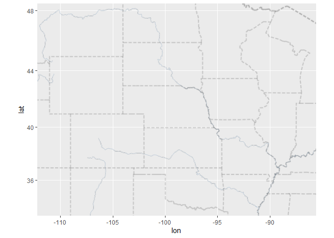

## Instructions
Answer the following questions and complete the exercises in RMarkdown. Please embed all of your code and push your final work to your repository. Your final lab report should be organized, clean, and run free from errors. Remember, you must remove the `#` for the included code chunks to run. Be sure to add your name to the author header above. For any included plots, make sure they are clearly labeled. You are free to use any plot type that you feel best communicates the results of your analysis.  

Make sure to use the formatting conventions of RMarkdown to make your report neat and clean!  

## Load the libraries  

```r
library(tidyverse)
library(janitor)
library(here)
library(ggmap)
```


## Load the Data
We will use two separate data sets for this homework.  

1. The first [data set](https://rcweb.dartmouth.edu/~f002d69/workshops/index_rspatial.html) represent sightings of grizzly bears (Ursos arctos) in Alaska.  ``


2. The second data set is from Brandell, Ellen E (2021), Serological dataset and R code for: Patterns and processes of pathogen exposure in gray wolves across North America, Dryad, [Dataset](https://doi.org/10.5061/dryad.5hqbzkh51).  

1. Load the `grizzly` data and evaluate its structure.  


```r
grizzly <- read.csv("data/bear-sightings.csv")
```


```r
glimpse(grizzly)
```

```
## Rows: 494
## Columns: 3
## $ bear.id   <int> 7, 57, 69, 75, 104, 108, 115, 116, 125, 135, 137, 162, 185, …
## $ longitude <dbl> -148.9560, -152.6228, -144.9374, -152.8485, -143.2948, -149.…
## $ latitude  <dbl> 62.65822, 58.35064, 62.38227, 59.90122, 61.07311, 62.91605, …
```

2. Use the range of the latitude and longitude to build an appropriate bounding box for your map.  


```r
grizzly %>% 
  select(latitude, longitude) %>% 
  summary()
```

```
##     latitude       longitude     
##  Min.   :55.02   Min.   :-166.2  
##  1st Qu.:58.13   1st Qu.:-154.2  
##  Median :60.97   Median :-151.0  
##  Mean   :61.41   Mean   :-149.1  
##  3rd Qu.:64.13   3rd Qu.:-145.6  
##  Max.   :70.37   Max.   :-131.3
```

```r
lat <- c(55.02, 70.37)
long <- c(-166.2, -131.3)
bbox <- make_bbox(long, lat, f = 0.05)
```


3. Load a map from `stamen` in a terrain style projection and display the map.  


```r
map1 <- get_map(bbox, maptype = "terrain", source = "stamen")
```

```
## ℹ Map tiles by Stamen Design, under CC BY 3.0. Data by OpenStreetMap, under ODbL.
```

```r
ggmap(map1)
```

<!-- -->


4. Build a final map that overlays the recorded observations of grizzly bears in Alaska.  


```r
ggmap(map1) + 
  geom_point(data = grizzly, aes(longitude, latitude)) +
  labs(x= "Longitude", y= "Latitude", title="Grizzly Locations")
```

<!-- -->


Let's switch to the wolves data. Brandell, Ellen E (2021), Serological dataset and R code for: Patterns and processes of pathogen exposure in gray wolves across North America, Dryad, [Dataset](https://doi.org/10.5061/dryad.5hqbzkh51).  

5. Load the data and evaluate its structure.  


```r
wolves <- read.csv("data/wolves_data/wolves_dataset.csv")
glimpse(wolves)
```

```
## Rows: 1,986
## Columns: 23
## $ pop                <chr> "AK.PEN", "AK.PEN", "AK.PEN", "AK.PEN", "AK.PEN", "…
## $ year               <int> 2006, 2006, 2006, 2006, 2006, 2006, 2006, 2006, 200…
## $ age.cat            <chr> "S", "S", "A", "S", "A", "A", "A", "P", "S", "P", "…
## $ sex                <chr> "F", "M", "F", "M", "M", "M", "F", "M", "F", "M", "…
## $ color              <chr> "G", "G", "G", "B", "B", "G", "G", "G", "G", "G", "…
## $ lat                <dbl> 57.03983, 57.03983, 57.03983, 57.03983, 57.03983, 5…
## $ long               <dbl> -157.8427, -157.8427, -157.8427, -157.8427, -157.84…
## $ habitat            <dbl> 254.08, 254.08, 254.08, 254.08, 254.08, 254.08, 254…
## $ human              <dbl> 10.42, 10.42, 10.42, 10.42, 10.42, 10.42, 10.42, 10…
## $ pop.density        <dbl> 8, 8, 8, 8, 8, 8, 8, 8, 8, 8, 8, 8, 8, 8, 8, 8, 8, …
## $ pack.size          <dbl> 8.78, 8.78, 8.78, 8.78, 8.78, 8.78, 8.78, 8.78, 8.7…
## $ standard.habitat   <dbl> -1.6339, -1.6339, -1.6339, -1.6339, -1.6339, -1.633…
## $ standard.human     <dbl> -0.9784, -0.9784, -0.9784, -0.9784, -0.9784, -0.978…
## $ standard.pop       <dbl> -0.6827, -0.6827, -0.6827, -0.6827, -0.6827, -0.682…
## $ standard.packsize  <dbl> 1.3157, 1.3157, 1.3157, 1.3157, 1.3157, 1.3157, 1.3…
## $ standard.latitude  <dbl> 0.7214, 0.7214, 0.7214, 0.7214, 0.7214, 0.7214, 0.7…
## $ standard.longitude <dbl> -2.1441, -2.1441, -2.1441, -2.1441, -2.1441, -2.144…
## $ cav.binary         <int> 1, 1, 1, 0, 1, 1, 1, 1, 1, 1, 1, 1, 1, 1, 1, 1, 1, …
## $ cdv.binary         <int> 0, 0, 0, 0, 0, 1, 0, 0, 0, 0, 0, 0, 0, 0, 0, 0, 0, …
## $ cpv.binary         <int> 0, 0, 1, 1, 0, 1, 0, 0, 0, 0, 1, 0, 0, 1, 0, 0, 0, …
## $ chv.binary         <int> 1, 1, 1, 1, 1, 1, 1, 1, 1, 0, 1, 1, 1, 1, 1, 1, 1, …
## $ neo.binary         <int> NA, NA, NA, 0, 0, NA, NA, 1, 0, 1, NA, 0, NA, NA, N…
## $ toxo.binary        <int> NA, NA, NA, 1, 0, NA, NA, 1, 0, 0, NA, 0, NA, NA, N…
```

6. How many distinct wolf populations are included in this study? Make a new object that restricts the data to the wolf populations in the lower 48 US states.  


```r
wolves %>% 
  tabyl(pop)
```

```
##      pop   n     percent
##   AK.PEN 100 0.050352467
##  BAN.JAS  96 0.048338369
##       BC 145 0.073011078
##   DENALI 154 0.077542800
##    ELLES  11 0.005538771
##     GTNP  60 0.030211480
##   INT.AK  35 0.017623364
##  MEXICAN 181 0.091137966
##       MI 102 0.051359517
##       MT 351 0.176737160
##    N.NWT  67 0.033736153
##      ONT  60 0.030211480
##    SE.AK  10 0.005035247
##      SNF  92 0.046324270
##   SS.NWT  34 0.017119839
##      YNP 383 0.192849950
##     YUCH 105 0.052870091
```


```r
wolves %>%                                  
  summarise(n_genera=n_distinct(pop))
```

```
##   n_genera
## 1       17
```

```r
wolves_mainland <- wolves %>% 
                      filter(pop == c("GTNP", "MEXICAN", "MI", "MT", "SNF", "YNP"))
wolves_mainland
```

```
##         pop year age.cat sex color      lat       long  habitat   human
## 1      GTNP 2013       A   F     G 43.81817 -110.70550 10375.16 3924.09
## 2      GTNP 2013       P   F     G 43.81817 -110.70550 10375.16 3924.09
## 3      GTNP 2014       P   M     G 43.81817 -110.70550 10375.16 3924.09
## 4      GTNP 2014       S   F     G 43.81817 -110.70550 10375.16 3924.09
## 5      GTNP 2015       S   M     G 43.81817 -110.70550 10375.16 3924.09
## 6      GTNP 2015       S   M     G 43.81817 -110.70550 10375.16 3924.09
## 7      GTNP 2016       A   F     B 43.81817 -110.70550 10375.16 3924.09
## 8      GTNP 2017       S   M     G 43.81817 -110.70550 10375.16 3924.09
## 9      GTNP 2018       P   F     G 43.81817 -110.70550 10375.16 3924.09
## 10     GTNP 2018       P   M     G 43.81817 -110.70550 10375.16 3924.09
## 11  MEXICAN 2006       P   F     G 33.88778 -109.17139 11860.81 2787.67
## 12  MEXICAN 2006       P   M     G 33.88778 -109.17139 11860.81 2787.67
## 13  MEXICAN 2006       S   M     G 33.88778 -109.17139 11860.81 2787.67
## 14  MEXICAN 2007       S   F     G 33.88778 -109.17139 11860.81 2787.67
## 15  MEXICAN 2007       S   F     G 33.88778 -109.17139 11860.81 2787.67
## 16  MEXICAN 2008       P   M     G 33.88778 -109.17139 11860.81 2787.67
## 17  MEXICAN 2009       P   F     G 33.88778 -109.17139 11860.81 2787.67
## 18  MEXICAN 2010       P   M     G 33.88778 -109.17139 11860.81 2787.67
## 19  MEXICAN 2011       P   F     G 33.88778 -109.17139 11860.81 2787.67
## 20  MEXICAN 2011       P   M     G 33.88778 -109.17139 11860.81 2787.67
## 21  MEXICAN 2012    <NA>   M     G 33.88778 -109.17139 11860.81 2787.67
## 22  MEXICAN 2012       P   F     G 33.88778 -109.17139 11860.81 2787.67
## 23  MEXICAN 2012       P   F     G 33.88778 -109.17139 11860.81 2787.67
## 24  MEXICAN 2012       P   M     G 33.88778 -109.17139 11860.81 2787.67
## 25  MEXICAN 2013       A   F     G 33.88778 -109.17139 11860.81 2787.67
## 26  MEXICAN 2013       S   M     G 33.88778 -109.17139 11860.81 2787.67
## 27  MEXICAN 2014       S   M     G 33.88778 -109.17139 11860.81 2787.67
## 28  MEXICAN 2015       P   F     G 33.88778 -109.17139 11860.81 2787.67
## 29  MEXICAN 2015       S   F     G 33.88778 -109.17139 11860.81 2787.67
## 30  MEXICAN 2016       P   M     G 33.88778 -109.17139 11860.81 2787.67
## 31  MEXICAN 2016       P   M     G 33.88778 -109.17139 11860.81 2787.67
## 32  MEXICAN 2016       P   M     G 33.88778 -109.17139 11860.81 2787.67
## 33  MEXICAN 2017       P   M     G 33.88778 -109.17139 11860.81 2787.67
## 34  MEXICAN 2017       P   M     G 33.88778 -109.17139 11860.81 2787.67
## 35  MEXICAN 2017       P   M     G 33.88778 -109.17139 11860.81 2787.67
## 36  MEXICAN 2017       S   F     G 33.88778 -109.17139 11860.81 2787.67
## 37  MEXICAN 2017       P   M     G 33.88778 -109.17139 11860.81 2787.67
## 38  MEXICAN 2018       P   M     G 33.88778 -109.17139 11860.81 2787.67
## 39  MEXICAN 2018       P   F     G 33.88778 -109.17139 11860.81 2787.67
## 40  MEXICAN 2018       P   F     G 33.88778 -109.17139 11860.81 2787.67
## 41  MEXICAN 2018       S   M     G 33.88778 -109.17139 11860.81 2787.67
## 42       MI 2004       S   F  <NA> 46.14715  -86.81887  9510.60 6228.64
## 43       MI 2008       A   F  <NA> 46.14715  -86.81887  9510.60 6228.64
## 44       MI 2009       S   F  <NA> 46.14715  -86.81887  9510.60 6228.64
## 45       MI 2009       A   F  <NA> 46.14715  -86.81887  9510.60 6228.64
## 46       MI 2009       A   M  <NA> 46.14715  -86.81887  9510.60 6228.64
## 47       MI 2010       S   F  <NA> 46.14715  -86.81887  9510.60 6228.64
## 48       MI 2010       P   F  <NA> 46.14715  -86.81887  9510.60 6228.64
## 49       MI 2011       A   M  <NA> 46.14715  -86.81887  9510.60 6228.64
## 50       MI 2012       A   M  <NA> 46.14715  -86.81887  9510.60 6228.64
## 51       MI 2012       A   F  <NA> 46.14715  -86.81887  9510.60 6228.64
## 52       MI 2013       S   F  <NA> 46.14715  -86.81887  9510.60 6228.64
## 53       MI 2013       A   F  <NA> 46.14715  -86.81887  9510.60 6228.64
## 54       MI 2014       P   M  <NA> 46.14715  -86.81887  9510.60 6228.64
## 55       MI 2015       A   M  <NA> 46.14715  -86.81887  9510.60 6228.64
## 56       MI 2016       A   M  <NA> 46.14715  -86.81887  9510.60 6228.64
## 57       MI 2016       A   F  <NA> 46.14715  -86.81887  9510.60 6228.64
## 58       MI 2017       S   F  <NA> 46.14715  -86.81887  9510.60 6228.64
## 59       MT 2005       A   M  <NA> 46.83493 -110.99242 11166.11 3239.57
## 60       MT 2005       S   M  <NA> 46.83493 -110.99242 11166.11 3239.57
## 61       MT 2005       A   M  <NA> 46.83493 -110.99242 11166.11 3239.57
## 62       MT 2005       P   F  <NA> 46.83493 -110.99242 11166.11 3239.57
## 63       MT 2006       P   F  <NA> 46.83493 -110.99242 11166.11 3239.57
## 64       MT 2005       A   M  <NA> 46.83493 -110.99242 11166.11 3239.57
## 65       MT 2006       A   F  <NA> 46.83493 -110.99242 11166.11 3239.57
## 66       MT 2006       A   F  <NA> 46.83493 -110.99242 11166.11 3239.57
## 67       MT 2006       S   F  <NA> 46.83493 -110.99242 11166.11 3239.57
## 68       MT 2006       A   M  <NA> 46.83493 -110.99242 11166.11 3239.57
## 69       MT 2006       A   M  <NA> 46.83493 -110.99242 11166.11 3239.57
## 70       MT 2007       P   M  <NA> 46.83493 -110.99242 11166.11 3239.57
## 71       MT 2007    <NA>   M  <NA> 46.83493 -110.99242 11166.11 3239.57
## 72       MT 2007       A   F  <NA> 46.83493 -110.99242 11166.11 3239.57
## 73       MT 2007       S   M  <NA> 46.83493 -110.99242 11166.11 3239.57
## 74       MT 2007       S   F  <NA> 46.83493 -110.99242 11166.11 3239.57
## 75       MT 2007       A   F  <NA> 46.83493 -110.99242 11166.11 3239.57
## 76       MT 2008       A   M  <NA> 46.83493 -110.99242 11166.11 3239.57
## 77       MT 2008       P   M  <NA> 46.83493 -110.99242 11166.11 3239.57
## 78       MT 2008       P   M  <NA> 46.83493 -110.99242 11166.11 3239.57
## 79       MT 2008       P   M  <NA> 46.83493 -110.99242 11166.11 3239.57
## 80       MT 2008    <NA>   F  <NA> 46.83493 -110.99242 11166.11 3239.57
## 81       MT 2008    <NA>   M  <NA> 46.83493 -110.99242 11166.11 3239.57
## 82       MT 2009    <NA>   F  <NA> 46.83493 -110.99242 11166.11 3239.57
## 83       MT 2009       S   M  <NA> 46.83493 -110.99242 11166.11 3239.57
## 84       MT 2009       S   M  <NA> 46.83493 -110.99242 11166.11 3239.57
## 85       MT 2010       S   M  <NA> 46.83493 -110.99242 11166.11 3239.57
## 86       MT 2010    <NA>   M  <NA> 46.83493 -110.99242 11166.11 3239.57
## 87       MT 2010       S   F  <NA> 46.83493 -110.99242 11166.11 3239.57
## 88       MT 2010    <NA>   M  <NA> 46.83493 -110.99242 11166.11 3239.57
## 89       MT 2011       A   F  <NA> 46.83493 -110.99242 11166.11 3239.57
## 90       MT 2011       A   M  <NA> 46.83493 -110.99242 11166.11 3239.57
## 91       MT 2011       S   F  <NA> 46.83493 -110.99242 11166.11 3239.57
## 92       MT 2011       A   F  <NA> 46.83493 -110.99242 11166.11 3239.57
## 93       MT 2011       A   F  <NA> 46.83493 -110.99242 11166.11 3239.57
## 94       MT 2012       A   F  <NA> 46.83493 -110.99242 11166.11 3239.57
## 95       MT 2012       A   M  <NA> 46.83493 -110.99242 11166.11 3239.57
## 96       MT 2012       A   F  <NA> 46.83493 -110.99242 11166.11 3239.57
## 97       MT 2012    <NA>   M  <NA> 46.83493 -110.99242 11166.11 3239.57
## 98       MT 2012       S   M  <NA> 46.83493 -110.99242 11166.11 3239.57
## 99       MT 2013       A   M  <NA> 46.83493 -110.99242 11166.11 3239.57
## 100      MT 2013       A   M  <NA> 46.83493 -110.99242 11166.11 3239.57
## 101      MT 2013       S   M  <NA> 46.83493 -110.99242 11166.11 3239.57
## 102      MT 2013       P   M  <NA> 46.83493 -110.99242 11166.11 3239.57
## 103      MT 2013       A   F  <NA> 46.83493 -110.99242 11166.11 3239.57
## 104      MT 2014       S   F  <NA> 46.83493 -110.99242 11166.11 3239.57
## 105      MT 2014       S   M  <NA> 46.83493 -110.99242 11166.11 3239.57
## 106      MT 2014       P   F  <NA> 46.83493 -110.99242 11166.11 3239.57
## 107      MT 2014       P   M  <NA> 46.83493 -110.99242 11166.11 3239.57
## 108      MT 2014       A   F  <NA> 46.83493 -110.99242 11166.11 3239.57
## 109      MT 2015       A   M  <NA> 46.83493 -110.99242 11166.11 3239.57
## 110      MT 2015       S   F  <NA> 46.83493 -110.99242 11166.11 3239.57
## 111      MT 2015       S   M  <NA> 46.83493 -110.99242 11166.11 3239.57
## 112      MT 2016       A   M  <NA> 46.83493 -110.99242 11166.11 3239.57
## 113      MT 2016       A   F  <NA> 46.83493 -110.99242 11166.11 3239.57
## 114      MT 2015       S   M  <NA> 46.83493 -110.99242 11166.11 3239.57
## 115      MT 2016       P   M  <NA> 46.83493 -110.99242 11166.11 3239.57
## 116      MT 2015    <NA>   F  <NA> 46.83493 -110.99242 11166.11 3239.57
## 117      MT 2016       A   F  <NA> 46.83493 -110.99242 11166.11 3239.57
## 118     SNF 2010       S   M     G 47.74968  -91.50045 32018.07 4557.60
## 119     SNF 2010       S   F     G 47.74968  -91.50045 32018.07 4557.60
## 120     SNF 2011       A   M     G 47.74968  -91.50045 32018.07 4557.60
## 121     SNF 2011       A   M     G 47.74968  -91.50045 32018.07 4557.60
## 122     SNF 2011       S   F     G 47.74968  -91.50045 32018.07 4557.60
## 123     SNF 2012       A   F     G 47.74968  -91.50045 32018.07 4557.60
## 124     SNF 2012       A   F     G 47.74968  -91.50045 32018.07 4557.60
## 125     SNF 2012       A   M     G 47.74968  -91.50045 32018.07 4557.60
## 126     SNF 2013       P   M     G 47.74968  -91.50045 32018.07 4557.60
## 127     SNF 2013       S   F     B 47.74968  -91.50045 32018.07 4557.60
## 128     SNF 2014       S   M  <NA> 47.74968  -91.50045 32018.07 4557.60
## 129     SNF 2015       A   F  <NA> 47.74968  -91.50045 32018.07 4557.60
## 130     SNF 2016       A   F  <NA> 47.74968  -91.50045 32018.07 4557.60
## 131     SNF 2016       A   M  <NA> 47.74968  -91.50045 32018.07 4557.60
## 132     SNF 2017       S   M  <NA> 47.74968  -91.50045 32018.07 4557.60
## 133     SNF 2017       P   M  <NA> 47.74968  -91.50045 32018.07 4557.60
## 134     YNP 1997       P   M     G 44.59645 -110.54720 11211.30 3973.47
## 135     YNP 1997       P   M     B 44.59645 -110.54720 11211.30 3973.47
## 136     YNP 1997       P   F     B 44.59645 -110.54720 11211.30 3973.47
## 137     YNP 1998       P   F     G 44.59645 -110.54720 11211.30 3973.47
## 138     YNP 1998       S   F     B 44.59645 -110.54720 11211.30 3973.47
## 139     YNP 1998       P   M     G 44.59645 -110.54720 11211.30 3973.47
## 140     YNP 1999       S   M     B 44.59645 -110.54720 11211.30 3973.47
## 141     YNP 2000       S   F     G 44.59645 -110.54720 11211.30 3973.47
## 142     YNP 2000       P   M     G 44.59645 -110.54720 11211.30 3973.47
## 143     YNP 2000       P   M     G 44.59645 -110.54720 11211.30 3973.47
## 144     YNP 2000       P   M     B 44.59645 -110.54720 11211.30 3973.47
## 145     YNP 2000       P   M     G 44.59645 -110.54720 11211.30 3973.47
## 146     YNP 2001       P   F     B 44.59645 -110.54720 11211.30 3973.47
## 147     YNP 2001       S   F     B 44.59645 -110.54720 11211.30 3973.47
## 148     YNP 2001       A   M     B 44.59645 -110.54720 11211.30 3973.47
## 149     YNP 2002       P   M     G 44.59645 -110.54720 11211.30 3973.47
## 150     YNP 2002       S   F     G 44.59645 -110.54720 11211.30 3973.47
## 151     YNP 2002       S   F     G 44.59645 -110.54720 11211.30 3973.47
## 152     YNP 2003       P   F     B 44.59645 -110.54720 11211.30 3973.47
## 153     YNP 2003       P   M     B 44.59645 -110.54720 11211.30 3973.47
## 154     YNP 2003       S   M     B 44.59645 -110.54720 11211.30 3973.47
## 155     YNP 2003       S   M     G 44.59645 -110.54720 11211.30 3973.47
## 156     YNP 2004       P   M     G 44.59645 -110.54720 11211.30 3973.47
## 157     YNP 2004       S   M     G 44.59645 -110.54720 11211.30 3973.47
## 158     YNP 2004       S   F     G 44.59645 -110.54720 11211.30 3973.47
## 159     YNP 2005       P   M     B 44.59645 -110.54720 11211.30 3973.47
## 160     YNP 2005       A   M     B 44.59645 -110.54720 11211.30 3973.47
## 161     YNP 2005       S   F     B 44.59645 -110.54720 11211.30 3973.47
## 162     YNP 2005       P   F     G 44.59645 -110.54720 11211.30 3973.47
## 163     YNP 2005       P   F     G 44.59645 -110.54720 11211.30 3973.47
## 164     YNP 2006       A   M     G 44.59645 -110.54720 11211.30 3973.47
## 165     YNP 2006       P   F     G 44.59645 -110.54720 11211.30 3973.47
## 166     YNP 2006       P   M     G 44.59645 -110.54720 11211.30 3973.47
## 167     YNP 2007       S   M     B 44.59645 -110.54720 11211.30 3973.47
## 168     YNP 2007       S   F     B 44.59645 -110.54720 11211.30 3973.47
## 169     YNP 2007       P   F     B 44.59645 -110.54720 11211.30 3973.47
## 170     YNP 2007       S   F     G 44.59645 -110.54720 11211.30 3973.47
## 171     YNP 2008       S   F     G 44.59645 -110.54720 11211.30 3973.47
## 172     YNP 2008       S   F     G 44.59645 -110.54720 11211.30 3973.47
## 173     YNP 2008       S   F     G 44.59645 -110.54720 11211.30 3973.47
## 174     YNP 2009       S   M     G 44.59645 -110.54720 11211.30 3973.47
## 175     YNP 2009       S   F     G 44.59645 -110.54720 11211.30 3973.47
## 176     YNP 2009       P   F     B 44.59645 -110.54720 11211.30 3973.47
## 177     YNP 2010       A   M     G 44.59645 -110.54720 11211.30 3973.47
## 178     YNP 2010       A   M     G 44.59645 -110.54720 11211.30 3973.47
## 179     YNP 2011       P   F     G 44.59645 -110.54720 11211.30 3973.47
## 180     YNP 2011       A   M     B 44.59645 -110.54720 11211.30 3973.47
## 181     YNP 2011       P   F     B 44.59645 -110.54720 11211.30 3973.47
## 182     YNP 2012       A   M     B 44.59645 -110.54720 11211.30 3973.47
## 183     YNP 2012       S   M     B 44.59645 -110.54720 11211.30 3973.47
## 184     YNP 2013       P   F     G 44.59645 -110.54720 11211.30 3973.47
## 185     YNP 2013       A   F     G 44.59645 -110.54720 11211.30 3973.47
## 186     YNP 2014       S   M     G 44.59645 -110.54720 11211.30 3973.47
## 187     YNP 2014       S   F     G 44.59645 -110.54720 11211.30 3973.47
## 188     YNP 2015       A   F     G 44.59645 -110.54720 11211.30 3973.47
## 189     YNP 2015       A   M     B 44.59645 -110.54720 11211.30 3973.47
## 190     YNP 2016       S   F     G 44.59645 -110.54720 11211.30 3973.47
## 191     YNP 2016       S   F     B 44.59645 -110.54720 11211.30 3973.47
## 192     YNP 2017       P   M     G 44.59645 -110.54720 11211.30 3973.47
## 193     YNP 2017       S   F     B 44.59645 -110.54720 11211.30 3973.47
## 194     YNP 2017       A   M     B 44.59645 -110.54720 11211.30 3973.47
## 195     YNP 2018       S   M     G 44.59645 -110.54720 11211.30 3973.47
## 196     YNP 2019       P   M     B 44.59645 -110.54720 11211.30 3973.47
## 197     YNP 2019       A   M     B 44.59645 -110.54720 11211.30 3973.47
##     pop.density pack.size standard.habitat standard.human standard.pop
## 1         33.96      8.10          -0.3062         0.9144       2.0715
## 2         33.96      8.10          -0.3062         0.9144       2.0715
## 3         33.96      8.10          -0.3062         0.9144       2.0715
## 4         33.96      8.10          -0.3062         0.9144       2.0715
## 5         33.96      8.10          -0.3062         0.9144       2.0715
## 6         33.96      8.10          -0.3062         0.9144       2.0715
## 7         33.96      8.10          -0.3062         0.9144       2.0715
## 8         33.96      8.10          -0.3062         0.9144       2.0715
## 9         33.96      8.10          -0.3062         0.9144       2.0715
## 10        33.96      8.10          -0.3062         0.9144       2.0715
## 11         3.99      4.04          -0.1113         0.3648      -1.1081
## 12         3.99      4.04          -0.1113         0.3648      -1.1081
## 13         3.99      4.04          -0.1113         0.3648      -1.1081
## 14         3.99      4.04          -0.1113         0.3648      -1.1081
## 15         3.99      4.04          -0.1113         0.3648      -1.1081
## 16         3.99      4.04          -0.1113         0.3648      -1.1081
## 17         3.99      4.04          -0.1113         0.3648      -1.1081
## 18         3.99      4.04          -0.1113         0.3648      -1.1081
## 19         3.99      4.04          -0.1113         0.3648      -1.1081
## 20         3.99      4.04          -0.1113         0.3648      -1.1081
## 21         3.99      4.04          -0.1113         0.3648      -1.1081
## 22         3.99      4.04          -0.1113         0.3648      -1.1081
## 23         3.99      4.04          -0.1113         0.3648      -1.1081
## 24         3.99      4.04          -0.1113         0.3648      -1.1081
## 25         3.99      4.04          -0.1113         0.3648      -1.1081
## 26         3.99      4.04          -0.1113         0.3648      -1.1081
## 27         3.99      4.04          -0.1113         0.3648      -1.1081
## 28         3.99      4.04          -0.1113         0.3648      -1.1081
## 29         3.99      4.04          -0.1113         0.3648      -1.1081
## 30         3.99      4.04          -0.1113         0.3648      -1.1081
## 31         3.99      4.04          -0.1113         0.3648      -1.1081
## 32         3.99      4.04          -0.1113         0.3648      -1.1081
## 33         3.99      4.04          -0.1113         0.3648      -1.1081
## 34         3.99      4.04          -0.1113         0.3648      -1.1081
## 35         3.99      4.04          -0.1113         0.3648      -1.1081
## 36         3.99      4.04          -0.1113         0.3648      -1.1081
## 37         3.99      4.04          -0.1113         0.3648      -1.1081
## 38         3.99      4.04          -0.1113         0.3648      -1.1081
## 39         3.99      4.04          -0.1113         0.3648      -1.1081
## 40         3.99      4.04          -0.1113         0.3648      -1.1081
## 41         3.99      4.04          -0.1113         0.3648      -1.1081
## 42        23.03      7.12          -0.4196         2.0290       0.9119
## 43        23.03      7.12          -0.4196         2.0290       0.9119
## 44        23.03      7.12          -0.4196         2.0290       0.9119
## 45        23.03      7.12          -0.4196         2.0290       0.9119
## 46        23.03      7.12          -0.4196         2.0290       0.9119
## 47        23.03      7.12          -0.4196         2.0290       0.9119
## 48        23.03      7.12          -0.4196         2.0290       0.9119
## 49        23.03      7.12          -0.4196         2.0290       0.9119
## 50        23.03      7.12          -0.4196         2.0290       0.9119
## 51        23.03      7.12          -0.4196         2.0290       0.9119
## 52        23.03      7.12          -0.4196         2.0290       0.9119
## 53        23.03      7.12          -0.4196         2.0290       0.9119
## 54        23.03      7.12          -0.4196         2.0290       0.9119
## 55        23.03      7.12          -0.4196         2.0290       0.9119
## 56        23.03      7.12          -0.4196         2.0290       0.9119
## 57        23.03      7.12          -0.4196         2.0290       0.9119
## 58        23.03      7.12          -0.4196         2.0290       0.9119
## 59        11.63      5.62          -0.2024         0.5834      -0.2976
## 60        11.63      5.62          -0.2024         0.5834      -0.2976
## 61        11.63      5.62          -0.2024         0.5834      -0.2976
## 62        11.63      5.62          -0.2024         0.5834      -0.2976
## 63        11.63      5.62          -0.2024         0.5834      -0.2976
## 64        11.63      5.62          -0.2024         0.5834      -0.2976
## 65        11.63      5.62          -0.2024         0.5834      -0.2976
## 66        11.63      5.62          -0.2024         0.5834      -0.2976
## 67        11.63      5.62          -0.2024         0.5834      -0.2976
## 68        11.63      5.62          -0.2024         0.5834      -0.2976
## 69        11.63      5.62          -0.2024         0.5834      -0.2976
## 70        11.63      5.62          -0.2024         0.5834      -0.2976
## 71        11.63      5.62          -0.2024         0.5834      -0.2976
## 72        11.63      5.62          -0.2024         0.5834      -0.2976
## 73        11.63      5.62          -0.2024         0.5834      -0.2976
## 74        11.63      5.62          -0.2024         0.5834      -0.2976
## 75        11.63      5.62          -0.2024         0.5834      -0.2976
## 76        11.63      5.62          -0.2024         0.5834      -0.2976
## 77        11.63      5.62          -0.2024         0.5834      -0.2976
## 78        11.63      5.62          -0.2024         0.5834      -0.2976
## 79        11.63      5.62          -0.2024         0.5834      -0.2976
## 80        11.63      5.62          -0.2024         0.5834      -0.2976
## 81        11.63      5.62          -0.2024         0.5834      -0.2976
## 82        11.63      5.62          -0.2024         0.5834      -0.2976
## 83        11.63      5.62          -0.2024         0.5834      -0.2976
## 84        11.63      5.62          -0.2024         0.5834      -0.2976
## 85        11.63      5.62          -0.2024         0.5834      -0.2976
## 86        11.63      5.62          -0.2024         0.5834      -0.2976
## 87        11.63      5.62          -0.2024         0.5834      -0.2976
## 88        11.63      5.62          -0.2024         0.5834      -0.2976
## 89        11.63      5.62          -0.2024         0.5834      -0.2976
## 90        11.63      5.62          -0.2024         0.5834      -0.2976
## 91        11.63      5.62          -0.2024         0.5834      -0.2976
## 92        11.63      5.62          -0.2024         0.5834      -0.2976
## 93        11.63      5.62          -0.2024         0.5834      -0.2976
## 94        11.63      5.62          -0.2024         0.5834      -0.2976
## 95        11.63      5.62          -0.2024         0.5834      -0.2976
## 96        11.63      5.62          -0.2024         0.5834      -0.2976
## 97        11.63      5.62          -0.2024         0.5834      -0.2976
## 98        11.63      5.62          -0.2024         0.5834      -0.2976
## 99        11.63      5.62          -0.2024         0.5834      -0.2976
## 100       11.63      5.62          -0.2024         0.5834      -0.2976
## 101       11.63      5.62          -0.2024         0.5834      -0.2976
## 102       11.63      5.62          -0.2024         0.5834      -0.2976
## 103       11.63      5.62          -0.2024         0.5834      -0.2976
## 104       11.63      5.62          -0.2024         0.5834      -0.2976
## 105       11.63      5.62          -0.2024         0.5834      -0.2976
## 106       11.63      5.62          -0.2024         0.5834      -0.2976
## 107       11.63      5.62          -0.2024         0.5834      -0.2976
## 108       11.63      5.62          -0.2024         0.5834      -0.2976
## 109       11.63      5.62          -0.2024         0.5834      -0.2976
## 110       11.63      5.62          -0.2024         0.5834      -0.2976
## 111       11.63      5.62          -0.2024         0.5834      -0.2976
## 112       11.63      5.62          -0.2024         0.5834      -0.2976
## 113       11.63      5.62          -0.2024         0.5834      -0.2976
## 114       11.63      5.62          -0.2024         0.5834      -0.2976
## 115       11.63      5.62          -0.2024         0.5834      -0.2976
## 116       11.63      5.62          -0.2024         0.5834      -0.2976
## 117       11.63      5.62          -0.2024         0.5834      -0.2976
## 118       25.32      4.81           2.5331         1.2208       1.1548
## 119       25.32      4.81           2.5331         1.2208       1.1548
## 120       25.32      4.81           2.5331         1.2208       1.1548
## 121       25.32      4.81           2.5331         1.2208       1.1548
## 122       25.32      4.81           2.5331         1.2208       1.1548
## 123       25.32      4.81           2.5331         1.2208       1.1548
## 124       25.32      4.81           2.5331         1.2208       1.1548
## 125       25.32      4.81           2.5331         1.2208       1.1548
## 126       25.32      4.81           2.5331         1.2208       1.1548
## 127       25.32      4.81           2.5331         1.2208       1.1548
## 128       25.32      4.81           2.5331         1.2208       1.1548
## 129       25.32      4.81           2.5331         1.2208       1.1548
## 130       25.32      4.81           2.5331         1.2208       1.1548
## 131       25.32      4.81           2.5331         1.2208       1.1548
## 132       25.32      4.81           2.5331         1.2208       1.1548
## 133       25.32      4.81           2.5331         1.2208       1.1548
## 134       28.93      8.25          -0.1965         0.9383       1.5378
## 135       28.93      8.25          -0.1965         0.9383       1.5378
## 136       28.93      8.25          -0.1965         0.9383       1.5378
## 137       28.93      8.25          -0.1965         0.9383       1.5378
## 138       28.93      8.25          -0.1965         0.9383       1.5378
## 139       28.93      8.25          -0.1965         0.9383       1.5378
## 140       28.93      8.25          -0.1965         0.9383       1.5378
## 141       28.93      8.25          -0.1965         0.9383       1.5378
## 142       28.93      8.25          -0.1965         0.9383       1.5378
## 143       28.93      8.25          -0.1965         0.9383       1.5378
## 144       28.93      8.25          -0.1965         0.9383       1.5378
## 145       28.93      8.25          -0.1965         0.9383       1.5378
## 146       28.93      8.25          -0.1965         0.9383       1.5378
## 147       28.93      8.25          -0.1965         0.9383       1.5378
## 148       28.93      8.25          -0.1965         0.9383       1.5378
## 149       28.93      8.25          -0.1965         0.9383       1.5378
## 150       28.93      8.25          -0.1965         0.9383       1.5378
## 151       28.93      8.25          -0.1965         0.9383       1.5378
## 152       28.93      8.25          -0.1965         0.9383       1.5378
## 153       28.93      8.25          -0.1965         0.9383       1.5378
## 154       28.93      8.25          -0.1965         0.9383       1.5378
## 155       28.93      8.25          -0.1965         0.9383       1.5378
## 156       28.93      8.25          -0.1965         0.9383       1.5378
## 157       28.93      8.25          -0.1965         0.9383       1.5378
## 158       28.93      8.25          -0.1965         0.9383       1.5378
## 159       28.93      8.25          -0.1965         0.9383       1.5378
## 160       28.93      8.25          -0.1965         0.9383       1.5378
## 161       28.93      8.25          -0.1965         0.9383       1.5378
## 162       28.93      8.25          -0.1965         0.9383       1.5378
## 163       28.93      8.25          -0.1965         0.9383       1.5378
## 164       28.93      8.25          -0.1965         0.9383       1.5378
## 165       28.93      8.25          -0.1965         0.9383       1.5378
## 166       28.93      8.25          -0.1965         0.9383       1.5378
## 167       28.93      8.25          -0.1965         0.9383       1.5378
## 168       28.93      8.25          -0.1965         0.9383       1.5378
## 169       28.93      8.25          -0.1965         0.9383       1.5378
## 170       28.93      8.25          -0.1965         0.9383       1.5378
## 171       28.93      8.25          -0.1965         0.9383       1.5378
## 172       28.93      8.25          -0.1965         0.9383       1.5378
## 173       28.93      8.25          -0.1965         0.9383       1.5378
## 174       28.93      8.25          -0.1965         0.9383       1.5378
## 175       28.93      8.25          -0.1965         0.9383       1.5378
## 176       28.93      8.25          -0.1965         0.9383       1.5378
## 177       28.93      8.25          -0.1965         0.9383       1.5378
## 178       28.93      8.25          -0.1965         0.9383       1.5378
## 179       28.93      8.25          -0.1965         0.9383       1.5378
## 180       28.93      8.25          -0.1965         0.9383       1.5378
## 181       28.93      8.25          -0.1965         0.9383       1.5378
## 182       28.93      8.25          -0.1965         0.9383       1.5378
## 183       28.93      8.25          -0.1965         0.9383       1.5378
## 184       28.93      8.25          -0.1965         0.9383       1.5378
## 185       28.93      8.25          -0.1965         0.9383       1.5378
## 186       28.93      8.25          -0.1965         0.9383       1.5378
## 187       28.93      8.25          -0.1965         0.9383       1.5378
## 188       28.93      8.25          -0.1965         0.9383       1.5378
## 189       28.93      8.25          -0.1965         0.9383       1.5378
## 190       28.93      8.25          -0.1965         0.9383       1.5378
## 191       28.93      8.25          -0.1965         0.9383       1.5378
## 192       28.93      8.25          -0.1965         0.9383       1.5378
## 193       28.93      8.25          -0.1965         0.9383       1.5378
## 194       28.93      8.25          -0.1965         0.9383       1.5378
## 195       28.93      8.25          -0.1965         0.9383       1.5378
## 196       28.93      8.25          -0.1965         0.9383       1.5378
## 197       28.93      8.25          -0.1965         0.9383       1.5378
##     standard.packsize standard.latitude standard.longitude cav.binary
## 1              0.9160           -0.7219             0.3219          1
## 2              0.9160           -0.7219             0.3219          1
## 3              0.9160           -0.7219             0.3219          1
## 4              0.9160           -0.7219             0.3219          1
## 5              0.9160           -0.7219             0.3219          1
## 6              0.9160           -0.7219             0.3219          1
## 7              0.9160           -0.7219             0.3219          1
## 8              0.9160           -0.7219             0.3219          1
## 9              0.9160           -0.7219             0.3219          1
## 10             0.9160           -0.7219             0.3219          1
## 11            -1.4705           -1.8059             0.4022         NA
## 12            -1.4705           -1.8059             0.4022         NA
## 13            -1.4705           -1.8059             0.4022         NA
## 14            -1.4705           -1.8059             0.4022         NA
## 15            -1.4705           -1.8059             0.4022         NA
## 16            -1.4705           -1.8059             0.4022         NA
## 17            -1.4705           -1.8059             0.4022         NA
## 18            -1.4705           -1.8059             0.4022         NA
## 19            -1.4705           -1.8059             0.4022         NA
## 20            -1.4705           -1.8059             0.4022         NA
## 21            -1.4705           -1.8059             0.4022         NA
## 22            -1.4705           -1.8059             0.4022         NA
## 23            -1.4705           -1.8059             0.4022         NA
## 24            -1.4705           -1.8059             0.4022         NA
## 25            -1.4705           -1.8059             0.4022         NA
## 26            -1.4705           -1.8059             0.4022         NA
## 27            -1.4705           -1.8059             0.4022         NA
## 28            -1.4705           -1.8059             0.4022         NA
## 29            -1.4705           -1.8059             0.4022         NA
## 30            -1.4705           -1.8059             0.4022         NA
## 31            -1.4705           -1.8059             0.4022         NA
## 32            -1.4705           -1.8059             0.4022         NA
## 33            -1.4705           -1.8059             0.4022         NA
## 34            -1.4705           -1.8059             0.4022         NA
## 35            -1.4705           -1.8059             0.4022         NA
## 36            -1.4705           -1.8059             0.4022         NA
## 37            -1.4705           -1.8059             0.4022         NA
## 38            -1.4705           -1.8059             0.4022         NA
## 39            -1.4705           -1.8059             0.4022         NA
## 40            -1.4705           -1.8059             0.4022         NA
## 41            -1.4705           -1.8059             0.4022         NA
## 42             0.3399           -0.4677             1.5716          1
## 43             0.3399           -0.4677             1.5716          1
## 44             0.3399           -0.4677             1.5716          1
## 45             0.3399           -0.4677             1.5716          0
## 46             0.3399           -0.4677             1.5716          1
## 47             0.3399           -0.4677             1.5716          1
## 48             0.3399           -0.4677             1.5716          0
## 49             0.3399           -0.4677             1.5716          1
## 50             0.3399           -0.4677             1.5716          1
## 51             0.3399           -0.4677             1.5716          1
## 52             0.3399           -0.4677             1.5716          1
## 53             0.3399           -0.4677             1.5716          1
## 54             0.3399           -0.4677             1.5716          0
## 55             0.3399           -0.4677             1.5716          0
## 56             0.3399           -0.4677             1.5716          1
## 57             0.3399           -0.4677             1.5716          1
## 58             0.3399           -0.4677             1.5716          0
## 59            -0.5418           -0.3926             0.3069          1
## 60            -0.5418           -0.3926             0.3069          0
## 61            -0.5418           -0.3926             0.3069          1
## 62            -0.5418           -0.3926             0.3069          1
## 63            -0.5418           -0.3926             0.3069          1
## 64            -0.5418           -0.3926             0.3069          1
## 65            -0.5418           -0.3926             0.3069          1
## 66            -0.5418           -0.3926             0.3069          1
## 67            -0.5418           -0.3926             0.3069          0
## 68            -0.5418           -0.3926             0.3069          1
## 69            -0.5418           -0.3926             0.3069          1
## 70            -0.5418           -0.3926             0.3069          0
## 71            -0.5418           -0.3926             0.3069          0
## 72            -0.5418           -0.3926             0.3069          1
## 73            -0.5418           -0.3926             0.3069          1
## 74            -0.5418           -0.3926             0.3069          1
## 75            -0.5418           -0.3926             0.3069          1
## 76            -0.5418           -0.3926             0.3069          0
## 77            -0.5418           -0.3926             0.3069          1
## 78            -0.5418           -0.3926             0.3069          0
## 79            -0.5418           -0.3926             0.3069          1
## 80            -0.5418           -0.3926             0.3069          1
## 81            -0.5418           -0.3926             0.3069          1
## 82            -0.5418           -0.3926             0.3069          1
## 83            -0.5418           -0.3926             0.3069          1
## 84            -0.5418           -0.3926             0.3069          1
## 85            -0.5418           -0.3926             0.3069          1
## 86            -0.5418           -0.3926             0.3069          1
## 87            -0.5418           -0.3926             0.3069          1
## 88            -0.5418           -0.3926             0.3069          1
## 89            -0.5418           -0.3926             0.3069          1
## 90            -0.5418           -0.3926             0.3069          1
## 91            -0.5418           -0.3926             0.3069          1
## 92            -0.5418           -0.3926             0.3069          1
## 93            -0.5418           -0.3926             0.3069          1
## 94            -0.5418           -0.3926             0.3069          1
## 95            -0.5418           -0.3926             0.3069          1
## 96            -0.5418           -0.3926             0.3069          1
## 97            -0.5418           -0.3926             0.3069          1
## 98            -0.5418           -0.3926             0.3069          1
## 99            -0.5418           -0.3926             0.3069          1
## 100           -0.5418           -0.3926             0.3069          1
## 101           -0.5418           -0.3926             0.3069          1
## 102           -0.5418           -0.3926             0.3069          0
## 103           -0.5418           -0.3926             0.3069          1
## 104           -0.5418           -0.3926             0.3069          1
## 105           -0.5418           -0.3926             0.3069          1
## 106           -0.5418           -0.3926             0.3069          1
## 107           -0.5418           -0.3926             0.3069          0
## 108           -0.5418           -0.3926             0.3069          1
## 109           -0.5418           -0.3926             0.3069          1
## 110           -0.5418           -0.3926             0.3069          1
## 111           -0.5418           -0.3926             0.3069          1
## 112           -0.5418           -0.3926             0.3069          1
## 113           -0.5418           -0.3926             0.3069          1
## 114           -0.5418           -0.3926             0.3069          1
## 115           -0.5418           -0.3926             0.3069          1
## 116           -0.5418           -0.3926             0.3069          1
## 117           -0.5418           -0.3926             0.3069          1
## 118           -1.0179           -0.2927             1.3267          1
## 119           -1.0179           -0.2927             1.3267          1
## 120           -1.0179           -0.2927             1.3267          1
## 121           -1.0179           -0.2927             1.3267          1
## 122           -1.0179           -0.2927             1.3267         NA
## 123           -1.0179           -0.2927             1.3267          1
## 124           -1.0179           -0.2927             1.3267          1
## 125           -1.0179           -0.2927             1.3267          1
## 126           -1.0179           -0.2927             1.3267          1
## 127           -1.0179           -0.2927             1.3267          1
## 128           -1.0179           -0.2927             1.3267         NA
## 129           -1.0179           -0.2927             1.3267         NA
## 130           -1.0179           -0.2927             1.3267         NA
## 131           -1.0179           -0.2927             1.3267         NA
## 132           -1.0179           -0.2927             1.3267         NA
## 133           -1.0179           -0.2927             1.3267         NA
## 134            1.0041           -0.6369             0.3302          1
## 135            1.0041           -0.6369             0.3302          1
## 136            1.0041           -0.6369             0.3302          1
## 137            1.0041           -0.6369             0.3302          1
## 138            1.0041           -0.6369             0.3302          1
## 139            1.0041           -0.6369             0.3302          1
## 140            1.0041           -0.6369             0.3302          1
## 141            1.0041           -0.6369             0.3302          1
## 142            1.0041           -0.6369             0.3302          1
## 143            1.0041           -0.6369             0.3302          1
## 144            1.0041           -0.6369             0.3302          1
## 145            1.0041           -0.6369             0.3302          1
## 146            1.0041           -0.6369             0.3302          1
## 147            1.0041           -0.6369             0.3302          1
## 148            1.0041           -0.6369             0.3302          1
## 149            1.0041           -0.6369             0.3302          1
## 150            1.0041           -0.6369             0.3302          1
## 151            1.0041           -0.6369             0.3302          1
## 152            1.0041           -0.6369             0.3302          1
## 153            1.0041           -0.6369             0.3302          1
## 154            1.0041           -0.6369             0.3302          1
## 155            1.0041           -0.6369             0.3302          1
## 156            1.0041           -0.6369             0.3302          1
## 157            1.0041           -0.6369             0.3302          1
## 158            1.0041           -0.6369             0.3302          1
## 159            1.0041           -0.6369             0.3302          1
## 160            1.0041           -0.6369             0.3302          1
## 161            1.0041           -0.6369             0.3302          1
## 162            1.0041           -0.6369             0.3302          1
## 163            1.0041           -0.6369             0.3302          1
## 164            1.0041           -0.6369             0.3302          1
## 165            1.0041           -0.6369             0.3302          1
## 166            1.0041           -0.6369             0.3302          1
## 167            1.0041           -0.6369             0.3302          1
## 168            1.0041           -0.6369             0.3302          1
## 169            1.0041           -0.6369             0.3302          1
## 170            1.0041           -0.6369             0.3302          1
## 171            1.0041           -0.6369             0.3302          1
## 172            1.0041           -0.6369             0.3302          1
## 173            1.0041           -0.6369             0.3302          1
## 174            1.0041           -0.6369             0.3302          1
## 175            1.0041           -0.6369             0.3302          1
## 176            1.0041           -0.6369             0.3302          1
## 177            1.0041           -0.6369             0.3302          1
## 178            1.0041           -0.6369             0.3302          1
## 179            1.0041           -0.6369             0.3302          0
## 180            1.0041           -0.6369             0.3302          1
## 181            1.0041           -0.6369             0.3302          1
## 182            1.0041           -0.6369             0.3302          1
## 183            1.0041           -0.6369             0.3302          1
## 184            1.0041           -0.6369             0.3302          1
## 185            1.0041           -0.6369             0.3302          1
## 186            1.0041           -0.6369             0.3302          1
## 187            1.0041           -0.6369             0.3302          1
## 188            1.0041           -0.6369             0.3302          1
## 189            1.0041           -0.6369             0.3302          1
## 190            1.0041           -0.6369             0.3302          1
## 191            1.0041           -0.6369             0.3302          1
## 192            1.0041           -0.6369             0.3302          1
## 193            1.0041           -0.6369             0.3302          1
## 194            1.0041           -0.6369             0.3302          1
## 195            1.0041           -0.6369             0.3302          1
## 196            1.0041           -0.6369             0.3302          1
## 197            1.0041           -0.6369             0.3302          1
##     cdv.binary cpv.binary chv.binary neo.binary toxo.binary
## 1            0          1          1          1           0
## 2            0          1          1          0           0
## 3            1          0          0          1           1
## 4            0          1          1          1           0
## 5            1          1          1          1           0
## 6            0          1          1          0           0
## 7            1          1          1          1           0
## 8            1          1          1          1           0
## 9            0          1          0          1           1
## 10           1          1          1          1           1
## 11          NA          1         NA         NA          NA
## 12          NA          1         NA         NA          NA
## 13          NA          1         NA         NA          NA
## 14          NA          1         NA         NA          NA
## 15           0          1         NA         NA          NA
## 16           0          0         NA         NA          NA
## 17           0          0         NA         NA          NA
## 18           1          0         NA         NA          NA
## 19           0          1         NA         NA          NA
## 20           0          0         NA         NA          NA
## 21           0          1         NA         NA          NA
## 22           0          1         NA         NA          NA
## 23           0          1         NA         NA          NA
## 24           0          1         NA         NA          NA
## 25           0          1         NA         NA          NA
## 26           0          1         NA         NA          NA
## 27           0          1         NA         NA          NA
## 28           0          0         NA         NA          NA
## 29           0          1         NA         NA          NA
## 30           0          1         NA         NA          NA
## 31           1          1         NA         NA          NA
## 32           0          1         NA         NA          NA
## 33           0          1         NA         NA          NA
## 34           0          1         NA         NA          NA
## 35           0          1         NA         NA          NA
## 36           0          1         NA         NA          NA
## 37           0          1         NA         NA          NA
## 38           0          1         NA         NA          NA
## 39           0          1         NA         NA          NA
## 40           0          1         NA         NA          NA
## 41           0          1         NA         NA          NA
## 42           0          1          1          0           1
## 43           0          0          1         NA           1
## 44           0          1          0          1           1
## 45           0          1          1          0           1
## 46           0          1          1          0           1
## 47           0          1          1          0           1
## 48           0          1          0          0           0
## 49           0          1          1          1           1
## 50           0          1          0          1           1
## 51           0          0          1          1           1
## 52           0          0          1          1           1
## 53           0          1          1          1           1
## 54           0          0          0          0           0
## 55           0          1          0          1           1
## 56           1          1          1          1           1
## 57           1          1          1          1           1
## 58           0          0          0          1           1
## 59           0          1         NA         NA          NA
## 60           1          1         NA         NA          NA
## 61           1          1         NA         NA          NA
## 62           0          1         NA         NA          NA
## 63           0          1         NA          0          NA
## 64           1          1         NA         NA          NA
## 65           1          1         NA          1          NA
## 66           1          1         NA         NA          NA
## 67           1          1         NA          0          NA
## 68           1          1         NA          0          NA
## 69           0          1         NA          0          NA
## 70           0          0         NA          1          NA
## 71           0          0         NA          0          NA
## 72           1          1         NA          0          NA
## 73           1          1         NA          1          NA
## 74           0          1         NA          0          NA
## 75           0          1         NA          0          NA
## 76           0          1         NA          1          NA
## 77           0          1         NA          0          NA
## 78           0          1         NA          0          NA
## 79           0          1         NA          0          NA
## 80           1          1         NA          0          NA
## 81           1          1         NA          0          NA
## 82           0          1          0          1          NA
## 83           0          1          0          1          NA
## 84           0          1         NA          0          NA
## 85           0          1          1          0          NA
## 86           0          1          1          0          NA
## 87           0          1          1          0          NA
## 88           0          1          1          0          NA
## 89           0          1          1          0          NA
## 90           0          1          1          1          NA
## 91           0          1          1          0          NA
## 92           0          1          1          0          NA
## 93           0          1          1          1          NA
## 94           0          1          1          0          NA
## 95           0          1          1          0          NA
## 96           1          1          0          0          NA
## 97           0          1          1          1          NA
## 98           0          1          1          0          NA
## 99           0          0          1          1          NA
## 100          1          1          1          1          NA
## 101          1          1          0          1          NA
## 102         NA         NA         NA         NA          NA
## 103          0          1          0          1          NA
## 104          0          1          1          1          NA
## 105          0          1          1          1          NA
## 106          0          0          1          1          NA
## 107          0          1          0          0          NA
## 108          0          1          1          0          NA
## 109          1          1          1          1          NA
## 110          0          1         NA          1          NA
## 111          0          1         NA          1          NA
## 112          0          0          1          0          NA
## 113          0          1          1          1          NA
## 114          0          1         NA          0          NA
## 115          0          1          0          0          NA
## 116          1          1         NA          1          NA
## 117          1          1          1          1          NA
## 118          0          1         NA         NA          NA
## 119          0          1         NA         NA          NA
## 120          1          1          0          1           0
## 121          1          1          1          0           1
## 122         NA         NA          0          0           0
## 123          0          1          1          0           1
## 124          0          1          1          1           0
## 125          0          1          1          1           1
## 126          0          0         NA         NA          NA
## 127          0          0         NA         NA          NA
## 128          0          1          0          0           0
## 129          0          1          1          0           1
## 130          1          1          1          1           1
## 131          0          1          1          0           1
## 132          0          1          1          0           1
## 133          0          1          1          0           0
## 134          0          1          0          0           0
## 135          0          1         NA         NA          NA
## 136          0          1          0          0           0
## 137          0          1          1          0           0
## 138          0          1          0          0           0
## 139          0          1          1          0           0
## 140          1          1          1          0           0
## 141          0          1          1          0           0
## 142          0          1          0          0           0
## 143          1          1          1          0           1
## 144          0          1         NA         NA           0
## 145          0          1          1          0           0
## 146          0          1          1          0           0
## 147          1          1          1          0          NA
## 148          0          1          1          0           0
## 149          0          1          1          0           1
## 150          0          1          1          0           0
## 151          0          1          1          0          NA
## 152          0          1          1          0          NA
## 153          0          1          1          0          NA
## 154          0          1          1          0          NA
## 155          1          1          1          0           0
## 156          0          1          1          0          NA
## 157          1          1          1          1           1
## 158          0          1         NA         NA          NA
## 159          0          1          1          0          NA
## 160          1          1          1          0           0
## 161          1          1          0          0           0
## 162          1          1          1          0           0
## 163          0          1          1          0           0
## 164          1          1          1          0           0
## 165          0          1          1          0           1
## 166          0          1          0          0           0
## 167          0          1          1          0           0
## 168          0          1          1          0           1
## 169          0          1          1          0           0
## 170          0          1          1          0           1
## 171          1          1          1          0           0
## 172          1          1          1          0           0
## 173          1          1          0          0           0
## 174          0          1          1         NA           0
## 175          1          1          1         NA          NA
## 176          0          1          1         NA          NA
## 177          1          1          1         NA           0
## 178          0          1          1         NA           0
## 179          0          1          1         NA          NA
## 180          1          1          1         NA          NA
## 181          0          1          1         NA          NA
## 182          1          1          1         NA          NA
## 183          0          1          1         NA           1
## 184          0          1          1         NA           1
## 185          0          1          1         NA           0
## 186          1          1          1         NA           0
## 187          0          0          0         NA          NA
## 188          0          1          1         NA          NA
## 189          0          1          1         NA          NA
## 190          1          1          1         NA           0
## 191          0          1          1         NA           1
## 192          0          1          1         NA           0
## 193          1          1          1         NA           0
## 194          1          1          1         NA           1
## 195          1          1          1          0           0
## 196          0          1          1          0           0
## 197          1          1          1          1           0
```

7. Use the range of the latitude and longitude to build an appropriate bounding box for your map.  


```r
wolves_mainland %>% 
  select(lat, long) %>% 
  summary()
```

```
##       lat             long        
##  Min.   :33.89   Min.   :-110.99  
##  1st Qu.:44.60   1st Qu.:-110.99  
##  Median :44.60   Median :-110.55  
##  Mean   :43.93   Mean   :-106.88  
##  3rd Qu.:46.83   3rd Qu.:-109.17  
##  Max.   :47.75   Max.   : -86.82
```

```r
lat <- c(33.89, 47.75)
long <- c(-110.99, -86.82)
bbox <- make_bbox(long, lat, f = 0.05)
```


8.  Load a map from `stamen` in a `terrain-lines` projection and display the map.  


```r
map2 <- get_map(bbox, maptype = "terrain-lines", source = "stamen")
```

```
## ℹ Map tiles by Stamen Design, under CC BY 3.0. Data by OpenStreetMap, under ODbL.
```

```r
ggmap(map2)
```

<!-- -->


9. Build a final map that overlays the recorded observations of wolves in the lower 48 states.  


```r
ggmap(map2) + 
  geom_point(data = wolves_mainland, aes(long, lat)) +
  labs(x= "Longitude", y= "Latitude", title="Wolves Locations")
```

<!-- -->


10. Use the map from #9 above, but add some aesthetics. Try to `fill` and `color` by population.  


```r
ggmap(map2) + 
  geom_point(data = wolves_mainland, aes(long, lat, color=pop, size=3))                                                                                                        +
   labs(x= "Longitude", y= "Latitude", title="Wolves Locations")
```

<!-- -->


## Push your final code to GitHub!
Please be sure that you check the `keep md` file in the knit preferences. 
